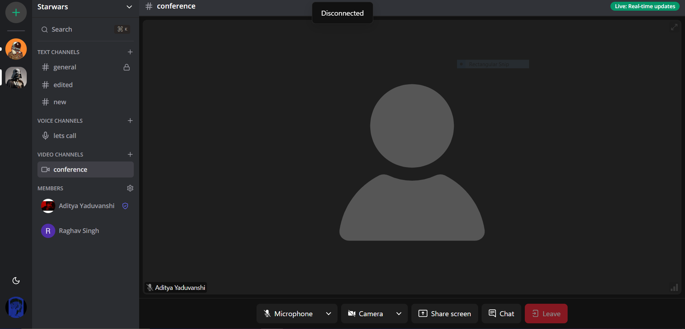
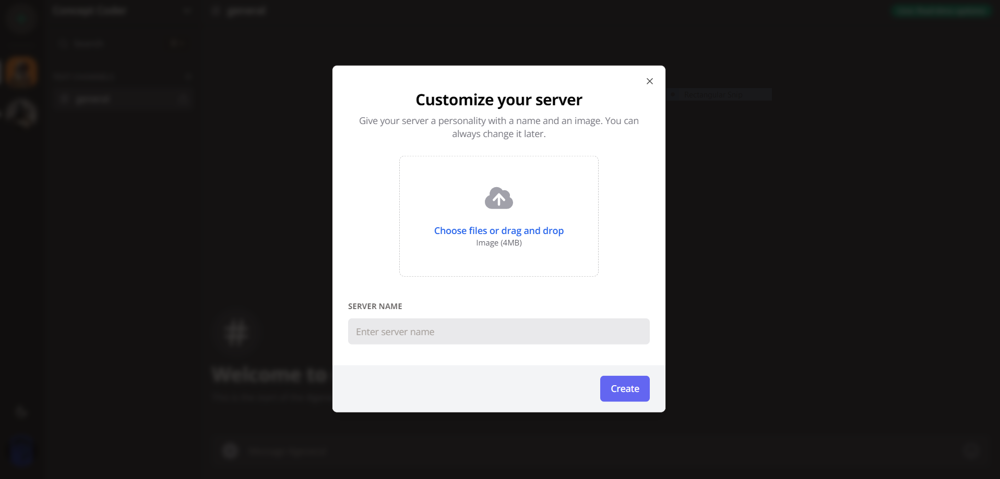

# NexusConnect - Discord Clone

A full-stack Discord clone that replicates the functionality of the popular communication platform. This project provides a comprehensive set of features including real-time messaging, message editing and deletion, file attachments, text/audio/video channels, 1:1 conversations, video calls, server creation, and customization. It also offers authentication, member management, and full responsivity for a seamless user experience.


## Demo

Link Link - https://nexusconnect.up.railway.app/


## Features

- Real-time messaging using Socket.io
- Send attachments as messages using UploadThing
- Member management (Kick, Role change Guest / Moderator)
- Delete & Edit messages in real time for all users
- Create Text, Audio and Video call Channels
- 1:1 conversation between members
- 1:1 video calls between members
- Unique invite link generation & full working invite system
- Infinite loading for messages in batches of 10 (tanstack/query)
- Server creation and customization
- Beautiful UI using TailwindCSS and ShadcnUI
- Full responsivity and mobile UI
- Light / Dark mode
- Websocket fallback: Polling with alerts
- ORM using Prisma
- MySQL database using Planetscale
- Authentication with Clerk


## Screenshots






## Technologies Used

NextJS, React, Prisma,Socket.io, Prisma, Tailwind, MySQL

## Cloning the repository

```bash
 git clone https://github.com/adityayaduvanshi/NexusConnect.git
```

## Install packages

```bash
 npm i
```

## Setup .env file

```bash
NEXT_PUBLIC_CLERK_PUBLISHABLE_KEY=
CLERK_SECRET_KEY=
NEXT_PUBLIC_CLERK_SIGN_IN_URL=
NEXT_PUBLIC_CLERK_SIGN_UP_URL=
NEXT_PUBLIC_CLERK_AFTER_SIGN_IN_URL=
NEXT_PUBLIC_CLERK_AFTER_SIGN_UP_URL=


DATABASE_URL=

UPLOADTHING_SECRET=
UPLOADTHING_APP_ID=

LIVEKIT_API_KEY=
LIVEKIT_API_SECRET=
NEXT_PUBLIC_LIVEKIT_URL=
```

## Setup Prisma

Add MySQL Database (I used PlanetScale)

```bash
npx prisma generate
npx prisma db push
```

## Start the app

```bash
npm run dev
```


